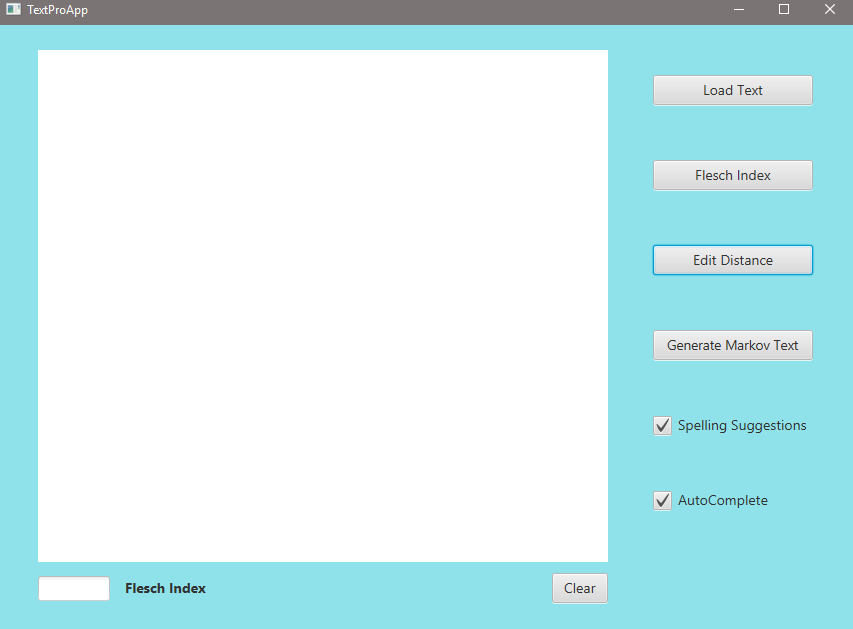
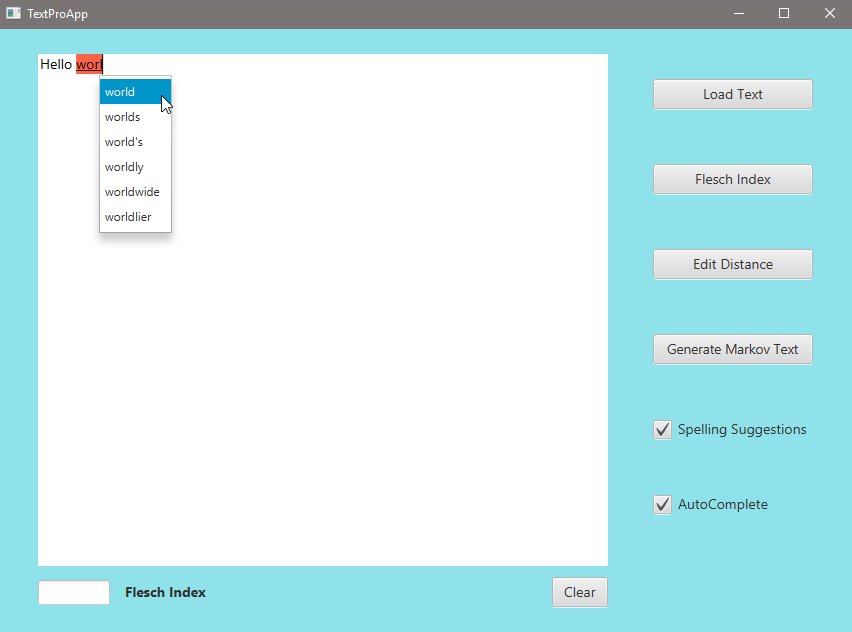
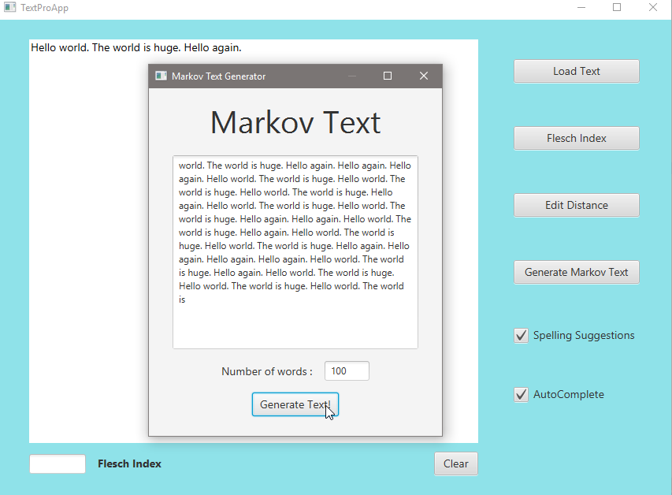
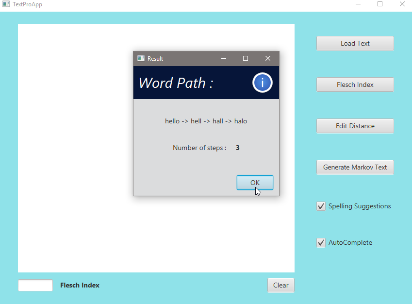

# Text Editor in Java

Overview:
* This projects was completed as part of course 2 of the Object Oriented Java Programming Data Structures and Beyond Specialization in Cousera. A starter code was provided for this project. The starter code and instructions to set it up can be found [here](https://www.coursera.org/learn/data-structures-optimizing-performance/supplement/7V5he/getting-and-working-with-the-starter-code). 
* The project works on Eclipse and uses Java 8. Follow the instructions to setup java Eclipse and e(fx)clipse [here](https://www.coursera.org/learn/data-structures-optimizing-performance/supplement/amsdH/setting-up-java-and-eclipse). 
* Backend features including word auto-complete, spelling suggestions, Markov text generator, flesch index calculation, and edit distance were implemented in addition to other tasks and test suites as instructed in the course.

To lauch the text editor, run `MainApp.java`. You should see the following popup:

To enable the autocomplete and spelling suggestions, check the respective boxes. Now the editor will highlight misspelled words and provide suggestion as shown below:

clicking the Generate Markov Text creates a Trie data structure based on the inputed text which is then used to create the Markov text as shown below

To find the edit distance between two words, use the edit distance button and type the desired words. This generate the edit distance showing the word path from one word to the other as can be seen below:

