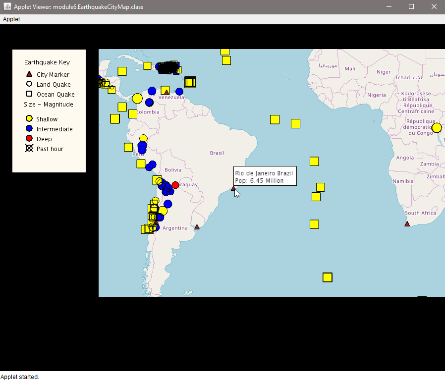
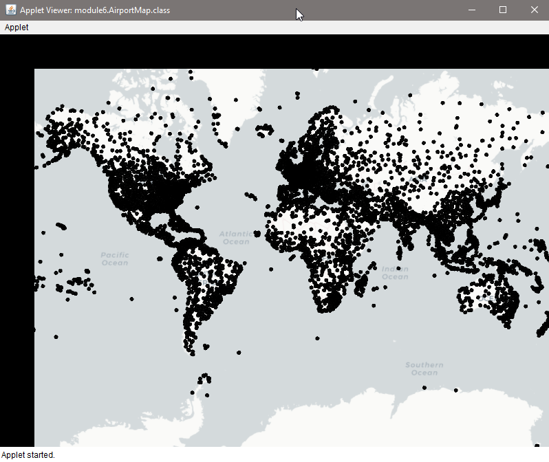
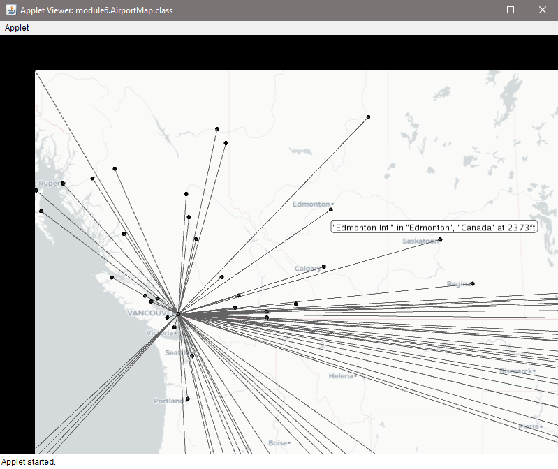

# Earthquake and Airport Data using Unfolding Maps in Java

Overview:
* This projects was completed as part of course 1 of the Object Oriented Java Programming Data Structures and Beyond Specialization in Cousera. A starter code was provided for this project and can be found [here](https://github.com/cjalvarado/Course1StarterCode). 
* The project works on Eclipse and uses Java 8. Follow the instructions in the starter code link to setup the project or visit the setup guide for Eclipse found [here](https://www.coursera.org/learn/object-oriented-java/supplement/zqSRy/setting-up-java-eclipse-and-unfolding-maps) and for the starter code found [here](https://www.coursera.org/learn/object-oriented-java/supplement/VLwq0/setting-up-unfolding-maps) on the course webpage.

Once you run the `EarthquakeCityMap.java`, you should see the map pop as shown below:

To zoom the map, double click on the area to zoom. Hovering on the marker will show the information about the marker as shown below.

Clicking the marker will hide all other markers as seen below

To see the map with airport markers, run the `AirportMap.java`, you should see the map pop as should below:

To see the routes from a particular airport, click on the desired airport marker. Hovering over the airport marker show the airport information. Shown below is the airport routes from Vancouver International Airport located 14ft above sea level. As for case for earthquake map, hovering the airport marker shows the airport name and elevation

For both maps, panning and zooming in and out is possiblle. Panning is activated by pressing and holding left mouse click then moving the mouse as desired. Zooming in is achieved by double clicking at the desired location. Zoom in and zoom out can also be achieved by mousepad or mouse wheel.