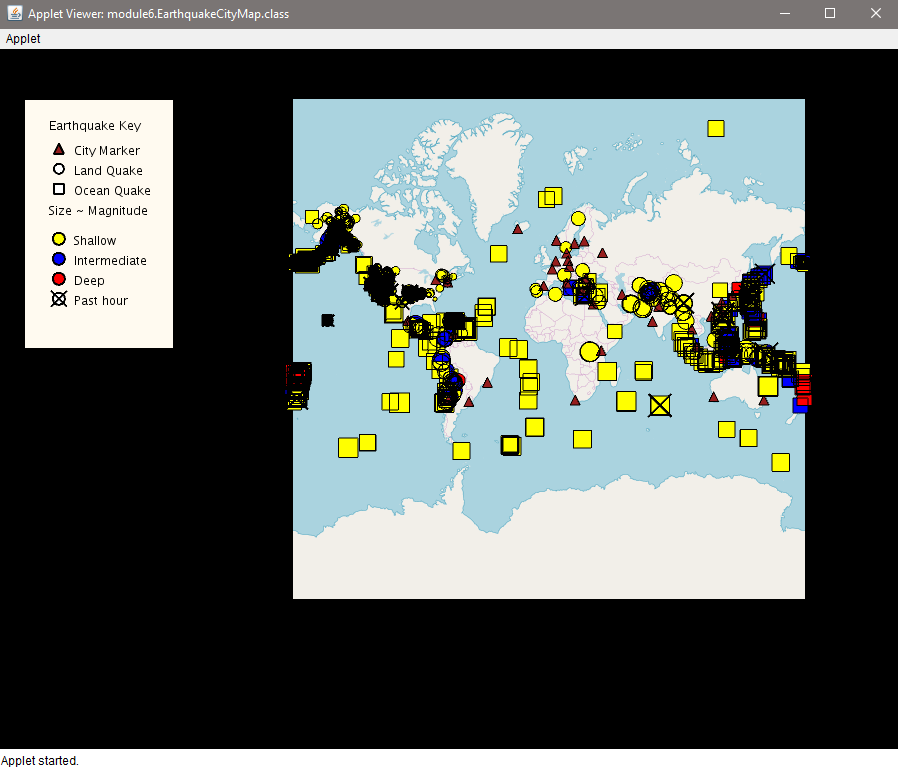

# Earthquake and Airport Data using Unfolding Maps in Java

Overview:
* This projects was completed as part of course 1 of the Object Oriented Java Programming Data Structures and Beyond Specialization in Cousera. A starter code was provided for this project and can be found [here](https://github.com/cjalvarado/Course1StarterCode). 
* The project works on Eclipse and uses Java 8. Follow the instructions in the starter code link to setup the project or visit the setup guide for Eclipse found [here](https://www.coursera.org/learn/object-oriented-java/supplement/zqSRy/setting-up-java-eclipse-and-unfolding-maps) and for the starter code found [here](https://www.coursera.org/learn/object-oriented-java/supplement/VLwq0/setting-up-unfolding-maps) on the course webpage.

Once you run the `EarthquakeCityMap.java`, you should see the map pop:

To zoom the map, double click on the area to zoom. Hovering the map on the marker will show the information about the marker as shown below.

Clicking the marker will hide all other markers as seen below

